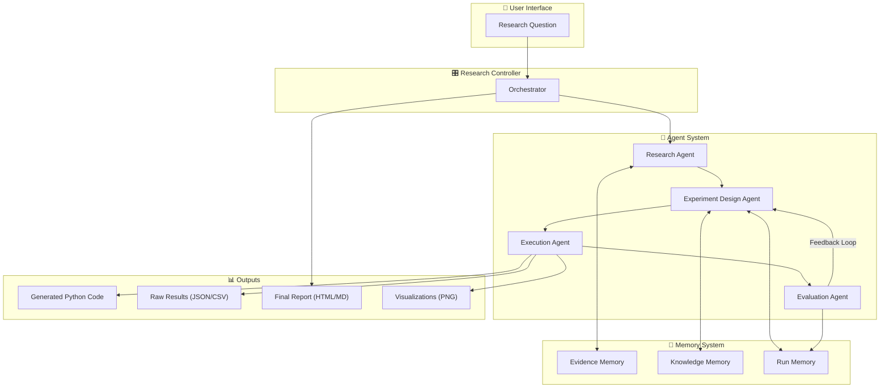
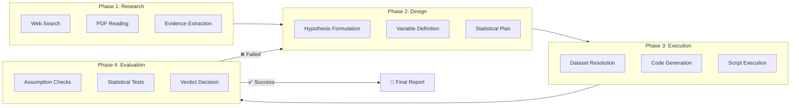
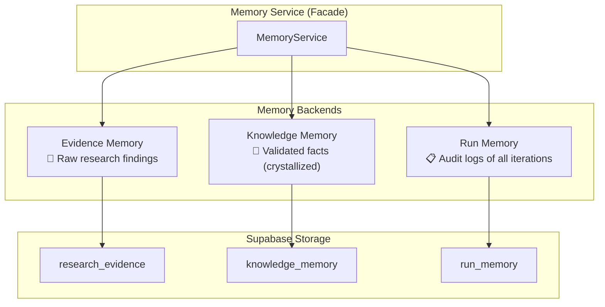
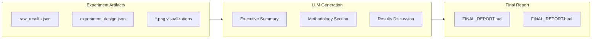
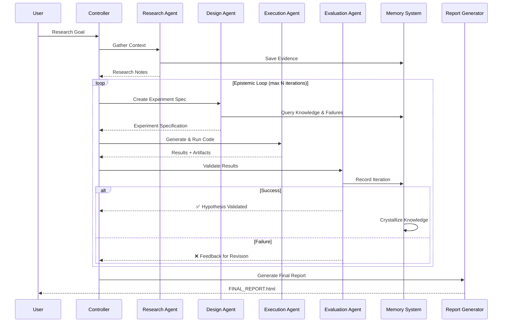

# Epsilon: Autonomous Research Engine
## Architecture & System Overview

---

## 📋 Executive Summary

**Epsilon** is an autonomous research engine that conducts end-to-end scientific discovery without human intervention. Given a high-level research question, it:

- 🔍 **Researches** background context from the web
- 🧪 **Designs** statistically rigorous experiments
- 💻 **Generates & Executes** Python code
- 📊 **Evaluates** results using statistical validation
- 📝 **Reports** findings in a professional HTML/Markdown report

---

## 🏗️ High-Level Architecture



---

## 🔄 The Epistemic Loop

The core innovation of Epsilon is its **self-correcting research loop**. The system iterates until it achieves statistically valid results.



---

## 🤖 Agent Breakdown

### 1. Research Agent (`research_agent.py`)

**Role**: The Literature Reviewer

| Tool | Purpose |
|------|---------|
| `web_search` | Search the web using Tavily API |
| `read_pdf` | Extract text from academic PDFs |
| `read_webpage` | Parse HTML content from articles |
| `save_evidence` | Persist key findings to Evidence Memory |
| `query_evidence` | Check existing evidence to avoid duplication |

**Output**: Structured research notes with citations and claims

---

### 2. Experiment Design Agent (`experiment_agent.py`)

**Role**: The Scientist

| Tool | Purpose |
|------|---------|
| `query_knowledge` | Retrieve validated facts from past runs |
| `query_past_failures` | Avoid repeating previous mistakes |
| `corpus_query` | Search the evidence corpus |

**Output**: JSON Experiment Specification including:
- Research question
- Hypotheses (H0, H1)
- Variables (independent, dependent, controls)
- Model design
- Dataset requirements
- Statistical analysis plan

---

### 3. Execution Agent (`execution_agent.py`)

**Role**: The Lab Technician

| Tool | Purpose |
|------|---------|
| `dataset_resolver` | Resolve data sources (sklearn, procedural, external) |
| `execute_experiment` | Run the generated Python script |
| `install_package` | Dynamically install missing dependencies |

**Output**: 
- `run_experiment.py` – Generated experiment code
- `raw_results.json` – Experiment data
- `*.png` – Visualizations

---

### 4. Evaluation Agent (`evaluation_agent.py`)

**Role**: The Statistician (Isolated by Design)

| Tool | Purpose |
|------|---------|
| `run_statistical_test` | Execute T-tests, ANOVA, Mann-Whitney, etc. |
| `verify_assumptions` | Check normality and other assumptions |
| `python_analysis_tool` | Execute custom Python analysis code |

**Output**: Evaluation verdict with:
- Hypothesis decision (Reject H0 / Fail to Reject)
- P-value and statistical summary
- Outcome classification
- Feedback for iteration

> **🔒 Epistemic Integrity**: The Evaluation Agent is intentionally isolated from the Design Agent to prevent p-hacking and preserve scientific rigor.

---

## 🧠 Memory Architecture

Epsilon uses a **three-tier memory system** backed by Supabase:



### Memory Types Explained

| Memory Type | Purpose | Persistence | Access Pattern |
|-------------|---------|-------------|----------------|
| **Evidence Memory** | Stores raw claims, PDFs, web sources | Per-run | Read-before-write deduplication |
| **Knowledge Memory** | Stores validated scientific conclusions | Crystallized on success | Append-only, high-precision |
| **Run Memory** | Stores complete audit trail of all iterations | Per-iteration | Query by failure type |

---

## 📊 Output Generation

### Report Generator (`core/report_generator.py`)

Produces a comprehensive scientific report:



**Report Sections**:
1. **Executive Summary** – LLM-generated overview
2. **Research Context** – Goal and hypothesis
3. **Audit Trail** – Complete iteration history
4. **Methodology** – Dataset and experimental design
5. **Results & Discussion** – Statistical findings with embedded visualizations

---

## 📁 Directory Structure

```
Epsilon/
├── controller.py          # 🎛️ Central orchestrator
├── research_agent.py      # 🔍 Web research & evidence
├── experiment_agent.py    # 🧪 Experiment design
├── execution_agent.py     # 💻 Code generation & execution
├── evaluation_agent.py    # 📊 Statistical validation
├── main.py                # 🚀 Entry point
│
├── core/
│   ├── identity.py        # User identity management
│   └── report_generator.py # Report generation
│
├── memory/
│   ├── memory_service.py   # Facade for all memory ops
│   ├── evidence_memory.py  # Raw research findings
│   ├── knowledge_memory.py # Crystallized facts
│   ├── run_memory.py       # Audit logs
│   ├── supabase_client.py  # Database connection
│   ├── policies.py         # Crystallization rules
│   └── types.py            # Shared type definitions
│
├── experiments/
│   └── {run_id}/           # Per-run isolated directory
│       ├── run_experiment.py
│       ├── raw_results.json
│       ├── comparison_plot.png
│       └── FINAL_REPORT.html
│
└── requirements.txt        # Dependencies
```

---

## 🔑 Key Design Principles

| Principle | Implementation |
|-----------|----------------|
| **Epistemic Integrity** | Evaluation Agent isolated from Design Agent |
| **Self-Correction** | Feedback loop with up to N iterations |
| **Run Isolation** | Each run gets its own `experiments/{run_id}/` directory |
| **Memory Persistence** | All findings stored in Supabase for cross-run learning |
| **Auditability** | Complete audit trail in Run Memory |
| **Reproducibility** | All code and data artifacts are preserved |

---

## 🚀 System Flow Summary



---

## ✅ What's Working

| Component | Status | Description |
|-----------|--------|-------------|
| Research Agent | ✅ Operational | Web search, PDF parsing, evidence extraction |
| Experiment Design | ✅ Operational | JSON spec generation with hypothesis |
| Code Execution | ✅ Operational | Script generation, dataset resolution, execution |
| Statistical Evaluation | ✅ Operational | T-tests, ANOVA, assumption checks |
| Memory System | ✅ Operational | Evidence, Knowledge, Run Memory with Supabase |
| Self-Correction Loop | ✅ Operational | Iterates on failures with feedback |
| Report Generation | ✅ Operational | HTML/Markdown with embedded plots |
| Run Isolation | ✅ Operational | Per-run experiment directories |

---

## 📌 Summary

Epsilon represents a complete autonomous research pipeline that:

1. **Autonomously researches** a topic using web and PDF sources
2. **Designs experiments** with proper statistical rigor
3. **Generates and executes** Python code in isolation
4. **Validates results** through independent statistical analysis
5. **Learns from failures** via a self-correcting feedback loop
6. **Produces professional reports** with visualizations and audit trails

The system is designed with **epistemic integrity** at its core, ensuring that the scientist (Design Agent) and the statistician (Evaluation Agent) remain separated to prevent bias in the research process.

---

*Generated for Epsilon Project Presentation*
