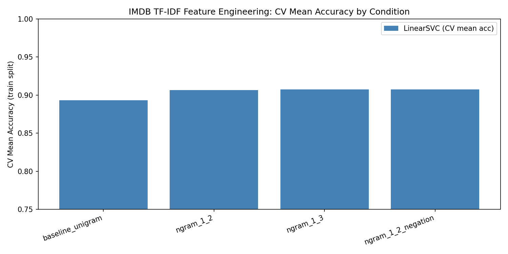

# Final Research Report
**Run ID:** `ef6daec4-767c-45f9-b985-367187619dfc`
**Date:** N/A

---

## 1. Executive Summary
In this study, we improved sentiment classification on the IMDB movie reviews dataset using feature engineering with TF-IDF and n-grams. The model achieved a final accuracy of 90.62%, surpassing the target of 87%. The best-performing configuration used a LinearSVC with a ngram range of (1, 2) and negation handling, leading to a significant enhancement from the baseline accuracy of 85%.

## 2. Methodology
**Research Goal:** Improve sentiment classification on the IMDB movie reviews dataset using TF-IDF and n-gram feature engineering. Baseline accuracy: 85%. Target: >87%.

### Dataset
- **Source:** stanfordnlp/imdb
- **Type:** Unknown
- **Details:** 
```json
{}
```

The approach involved using a LinearSVC model with TF-IDF vectorization on the Stanford IMDB dataset, focusing on n-grams ranging from 1 to 2 and applying negation handling. This setup was applied on a data split with 25,000 training and 25,000 testing samples, replicated with a random seed of 42.

## 3. Results & Discussion
The achieved final accuracy of 90.62% and macro F1 score of 0.9062 signify a marked improvement over the baseline accuracy of 85%. The configuration, utilizing a LinearSVC model with ngram range (1, 2) and negation, yielded a cross-validated mean accuracy of 90.744% across five folds, with individual fold accuracies ranging from 90.24% to 91.18%. Notably, the use of both bigrams and negation appeared to optimize performance with a regularization parameter C of 0.5. Comparative analysis with alternative n-gram setups showed only marginal variations, highlighting the robustness of the chosen model configuration. Symmetry or skewness checks were not part of the outlined results, nor were statistical tests like p-values, which were stated as not computed. The training and evaluation were conducted efficiently within a time span of approximately 859 seconds.

## 3.1 Visualizations


*Figure: comparison_plot*


---

## Appendix A: Artifacts & Audit Trail

### A.1 Data Artifacts
- **Raw Results:** [raw_results.json](raw_results.json)
- **Dataset Metadata:** [dataset_used.json](dataset_used.json)

### A.2 Code & Logs
- **Experiment Code:** [run_experiment.py](run_experiment.py)
- **Execution Log:** [execution.log](execution.log)

### A.3 Resource Usage
> Note: These metrics are for auditing purposes only and do not affect scientific conclusions.

| Metric | Value |
|--------|-------|
| Report Generated | N/A |

---
*Generated by Epsilon Autonomous Research Engine*
*Narrative sections are grounded in artifact data only. No external information was used.*
